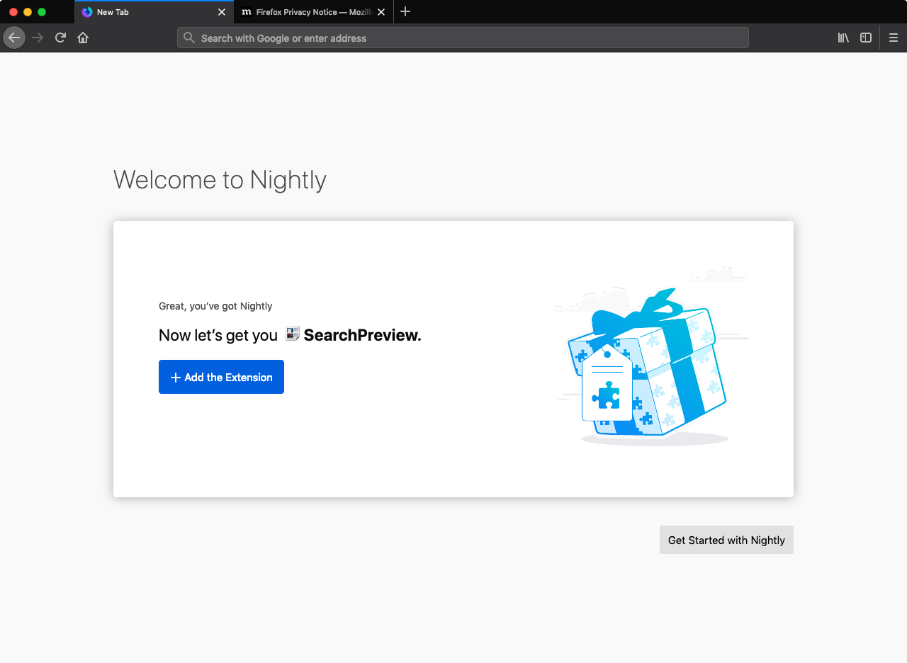

# return-to-amo-e2e-test

E2E testing the Return To AMO flow using Firefox Nightly

1. Download Firefox Nightly (67) from https://www.mozilla.org/en-US/firefox/channel/desktop/
1. Extract the Firefox\ Nightly.app file from the .DMG into ~/Documents/ (or wherever).
1. Rename the "Firefox\ Nightly.app" to "Firefox.app" (its less typing).
1. Download @mixedpuppy's showattrs.sh script from https://pastebin.com/kWZ3DhdZ and save it to the same directory as the extracted "Firefox.app" binary.
1. Make sure the showattrs.sh script is executable using <kbd>$ chmod +x showattrs.sh</kbd>.

    ```sh
    $ ls -lh

    drwxr-xr-x@ 3 pdehaan  staff    96B 13 Feb 05:13 Firefox.app
    -rwxr-xr-x  1 pdehaan  staff   810B 13 Feb 12:56 showattrs.sh
    ```

1. Run <kbd>$ ./showattrs.sh Firefox.app</kbd> to copy the attributes into the Firefox.app binary.
1. Per https://bugzilla.mozilla.org/show_bug.cgi?id=1525076#c2, launch the Firefox app via <kbd>$ ./Firefox.app/Contents/MacOS/firefox-bin -P profile</kbd>.
1. This should launch Firefox w/ the profile chooser. Create a new profile and click "OK".
1. Launch "about:welcome", if it didn't open already as part of the default tabs. My default tabs were: 
    - https://www.mozilla.org/en-US/firefox/nightly/firstrun/
    - https://www.mozilla.org/en-US/privacy/firefox/
1. You should see a screen saying "Great, you've got Nightly. Now let's get you Search Preview [+ Add the Extension]".

    

1. Open "about:addons" > Extensions and verify that no add-ons are currently installed in the new profile.
1. Click the [+ Add the Extension] button on the about:welcome page, and then click the "Add" button to accept the permissions request. You should now see the "SearchPreview has been added to Nightly" doorhanger.
1. Refresh about:addons > Extensions and verify the SearchPreview add-on is now installed.
